<!-- START doctoc generated TOC please keep comment here to allow auto update -->
<!-- DON'T EDIT THIS SECTION, INSTEAD RE-RUN doctoc TO UPDATE -->
**Table of Contents**  *generated with [DocToc](https://github.com/thlorenz/doctoc)*

- [Getting Stated with Apache Kafka](#getting-stated-with-apache-kafka)
  - [Installation](#installation)
  - [Architecture](#architecture)
    - [Messaging System](#messaging-system)
    - [Kafka Cluster](#kafka-cluster)
    - [Distributed Consensus with Zookeeper](#distributed-consensus-with-zookeeper)
  - [Understanding Topics, Partitions, and Brokers](#understanding-topics-partitions-and-brokers)
    - [Topics in Detail](#topics-in-detail)
    - [Consumer Offset and Message Retention Policy](#consumer-offset-and-message-retention-policy)
    - [Demo](#demo)
    - [Distributed Commit Log](#distributed-commit-log)
    - [Partitions in Detail](#partitions-in-detail)
    - [Distributed Partition Management](#distributed-partition-management)
    - [Achieving Reliability](#achieving-reliability)
    - [Demo Fault-tolerance and Resiliency](#demo-fault-tolerance-and-resiliency)
  - [Producing Messages with Producers](#producing-messages-with-producers)
    - [Intro](#intro)
    - [Process of Sending Messages (Part 1)](#process-of-sending-messages-part-1)
    - [Process of Sending Messages (Part 2)](#process-of-sending-messages-part-2)
    - [Message Buffering and Micro-batching](#message-buffering-and-micro-batching)
    - [Message Delivery and Ordering Guarantee](#message-delivery-and-ordering-guarantee)
    - [Demo](#demo-1)
    - [Advanced Topics](#advanced-topics)
  - [Consuming Messages with Consumers](#consuming-messages-with-consumers)
    - [Subscribing and Unsubscribing to Topics](#subscribing-and-unsubscribing-to-topics)
    - [Subscribe vs Assign](#subscribe-vs-assign)
    - [Single Consumer Topic Subscriptions](#single-consumer-topic-subscriptions)
    - [The Poll Loop](#the-poll-loop)
    - [Consumer Polling](#consumer-polling)
    - [Message Processing](#message-processing)
    - [Consumer Offset in Detail](#consumer-offset-in-detail)
    - [Offset Behaviour and Management](#offset-behaviour-and-management)
    - [CommitSync and CommitAsync](#commitsync-and-commitasync)
    - [When to Manage Your Own Offsets](#when-to-manage-your-own-offsets)
    - [Scaling-out Consumers](#scaling-out-consumers)

<!-- END doctoc generated TOC please keep comment here to allow auto update -->

# Getting Stated with Apache Kafka

Notes from Pluralsight [course](https://app.pluralsight.com/library/courses/apache-kafka-getting-started/table-of-contents).

## Installation

Rather than installing Kafka directly on your machine, use [docker-compose.yml](https://github.com/karafka/karafka/blob/master/docker-compose.yml) from [Karafka](https://github.com/karafka/karafka).

Start Kafka & Zookeeper with docker:

```
docker-compose up
```

In another terminal run shell in kafka container:

```
docker-compose exec kafka bash
```

In the shell, you can run any Kafka commands, eg:

```bash
./opt/kafka/bin/kafka-topics.sh --create --topic my_topic --replication-factor 1 --partitions 1 --zookeeper zookeeper:2181
```

May need to `docker rm -f zookeeper_learning` and `docker rm -f kafka_learning` or figure out how to clean `/tmp` dirs between start/stop.

## Architecture

### Messaging System

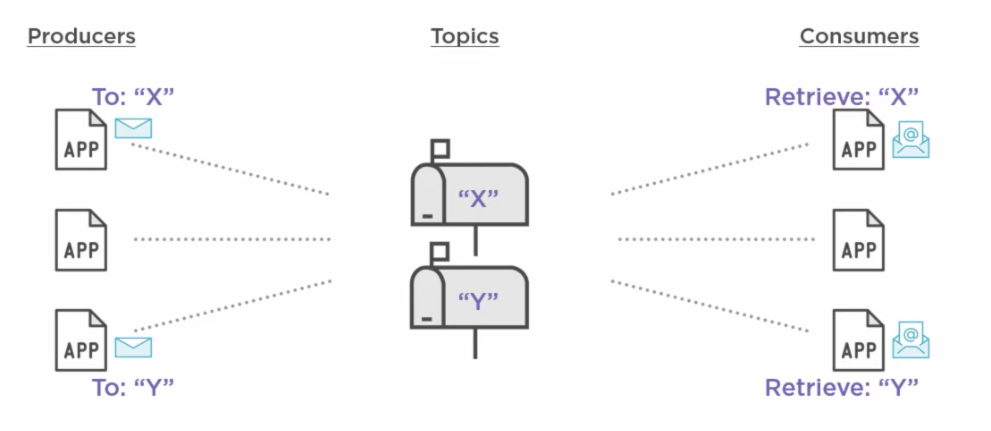

- pub/sub messaging system
- publisher (aka producer) creates message and sends to particular location
- interested and authorized subscriber (aka consumer) can retrieve these messages
- producers and consumers are applications that a developer writes that implement producing and consuming APIs
- messages are produced to (or consumed from) a *topic*
- topic is a grouping/collection of messages
- topics have a specific name
- producers produce a message to a named topic
- consumers retrieve messages from a named topic

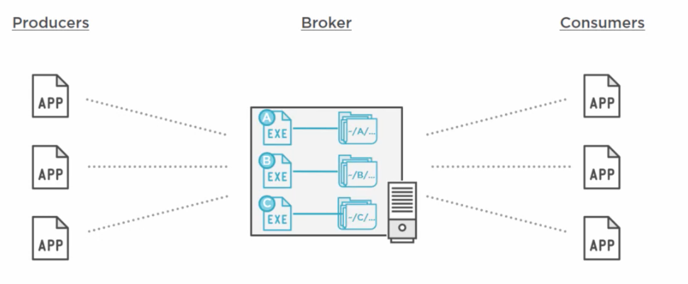

- Messages and topics are maintained in a *broker*.
- Broker is a software process (daemon) that runs on a physical or virtual machine
- Broker has access to file system on the machine, which is where the messages are stored.
- Broker categorizes messages as topics.
- Multiple brokers can run on a machine but each must have unique settings to avoid conflicts

### Kafka Cluster

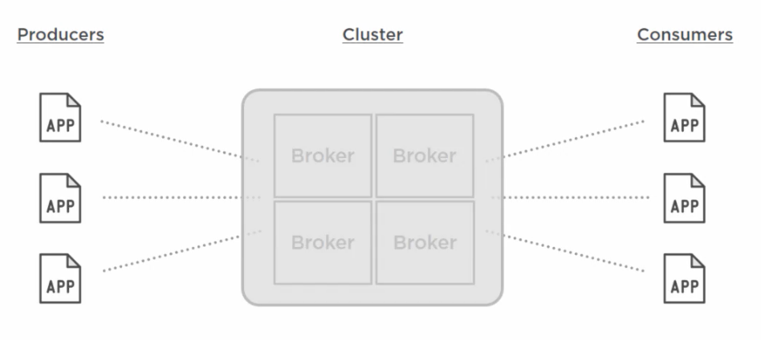

* High-throughput distributed messaging system.
* Ability to process in parallel on multiple nodes.
* To achieve high throughput with Kafka, scale out the number of brokers
* Increasing number of brokers has no effect on existing producers and consumers
* A cluster is a *grouping* of multiple Kafka brokers
* Can have a single broker or multiple brokers on a single machine, or brokers on different machines.

**Cluster Size**

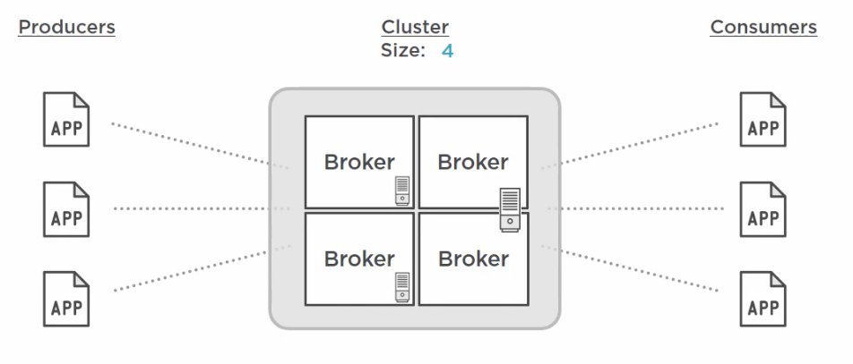

Examples:
* A single broker on a single machine -> cluster size is 1
* Two brokers running on same machine -> cluster size is 2
* Two brokers each running on their own machine -> cluster size is still 2

**Zookeeper**

* Independent brokers must be grouped together to form a cluster
* Grouping mechanism that determines a clusters membership of brokers is key to Kafka's architecture - this is what enables it to scale, and be distributed and fault-tolerant.
* Zookeeper is what manages this - more later in course.

### Distributed Consensus with Zookeeper

Used in many distributed systems such as Hadoop, HBase, Mesos, Solr, Redis, Neo4j. Complex enough to have its own course, only touching on it here.

It's a centralized service for maintaining metadata about a cluster of distributed nodes, this metadata includes:

* Config info
* Health status
* Group membership (includes roles of elected nodes - who is the leader)

Zookeeper is also a distributed system, runs on multiple nodes that form an *ensemble*. Typically one ensemble powers one or many Kafka clusters.

**All Together Distributed Architecture**

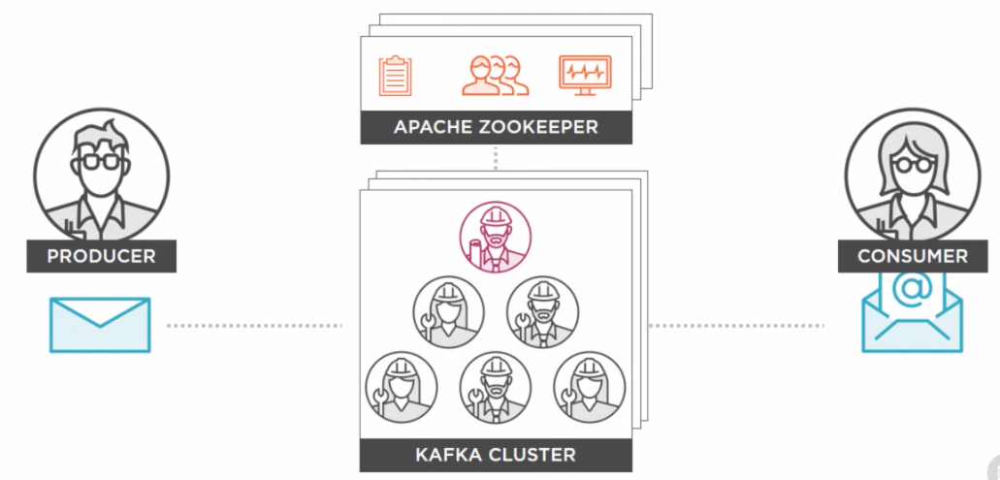

Each component can scale out.

## Understanding Topics, Partitions, and Brokers

### Topics in Detail

* Main Kafka abstraction
* Named feed or category of messages
* Analogy to mailbox: addressable, referencable collection point for messages
* Producers produce a message to a topic
* Consumers consume messages from a topic
* Topic is a *logical entity*
* Topic spans across entire cluster of brokers
* Producers and consumers don't need to worry about where/how messages are stored, all they need is topic name
* Physically, each topic is maintained as one or more log files

**Logical View of Topic**

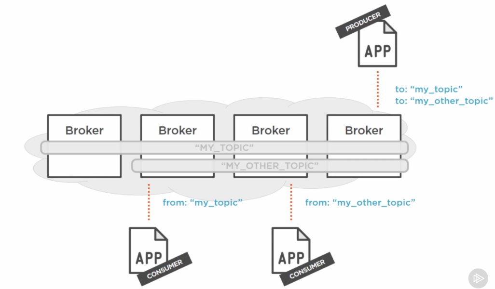

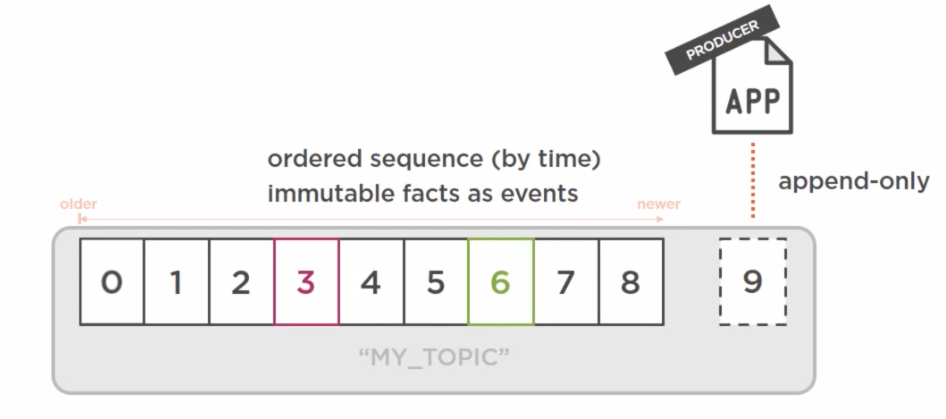

* When producer sends message to a topic, messages are appended to time-ordered sequential stream
* Each message represents an event (aka fact)
* Events are immutable - once received into topic, can't be modified
* If producer sends incorrect message, has to send more message(s) that are correct
* Consumer is responsible for reading the messages and reconciling them if a newer message "corrects" the mistake of an older message

**Event Sourcing**

Architectural style: Application state maintained by capturing all changes as a sequence of time-ordered, immutable events.

**Message Content**

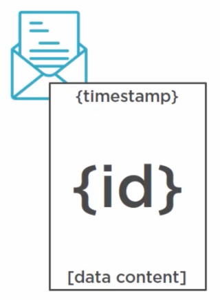

Each message has:
- timestamp when message is received by broker
- unique ID (combination of timestamp and ID form its placement in the sequence of messages contained in topic)
- consumers can reference the message ID
- message contains binary payload of data

**Many Consumers**

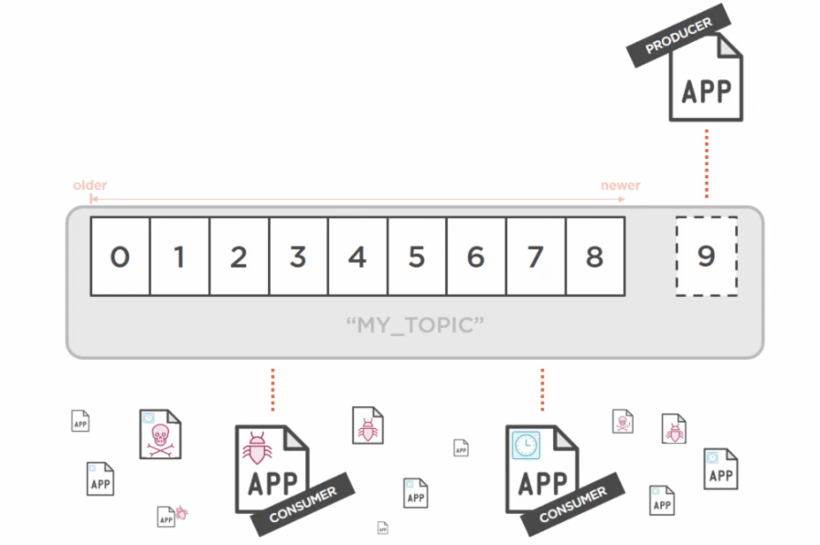

* Message consumption can happen from any number of independent/autonomous consumers.
* If one consumer erroneously consumes a message, or crashes altogether, does not impact any other consumers.

### Consumer Offset and Message Retention Policy

* Message offset is how multiple consumers maintain their autonomy when consuming messages from the same topic.
* Offset is similar to a bookmark that maintains the last read position, it's the last read message.
* Offset is maintained by consumer
* Offset refers to message identifier

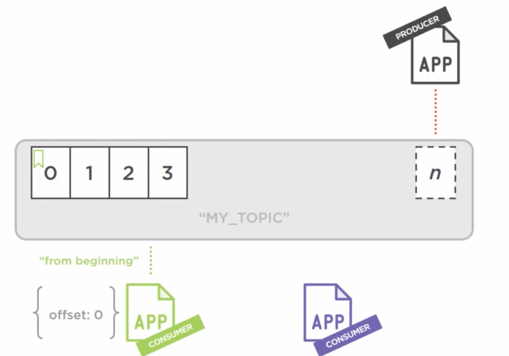

* When consumer wants to read from a topic, first it establishes connection with broker.
* Then consumer decides which messages it wants to consume
* Consumer can issue a statement to read `from beginning` of topic, this implies: `{ offset: 0 }`

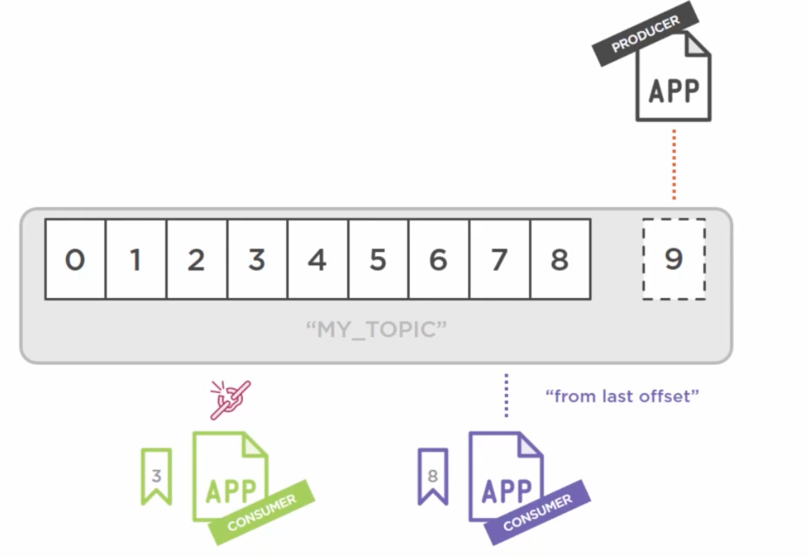

Another consumer can also read this topic, but has already consumed the existing messages, and is waiting for more messages to arrive. In this case it will read `from last offset`. Consumer uses offset to keep track of where it left off in the topic.

When new messages arrive, connected consumer(s) receive event indicating there's a new message, and the consumer can advance its position after retrieving the new message. When last message is read, consumer advances its offset, and its all caught up.

**Message Retention Policy**

* Slow consumers do not affect broker performance because Kafka can retain messages for a long time.
* This value is configurable - message retention policy.
* Messages are retained even after consumer(s) have consumed the messages.
* Default retention period is 168 hours (i.e. 7 days), after this, oldest messages will disappear.
* Retention period set on per-topic basis.
* Physical storage resources can constrain message retention.

### Demo

Start Kafka & Zookeeper with docker:

```
docker-compose up
```

In another terminal run shell in kafka container:

```
docker-compose exec kafka bash
```

In container, create topic:

```bash
./opt/kafka/bin/kafka-topics.sh --create --topic my_topic --replication-factor 1 --partitions 1 --zookeeper zookeeper:2181
```

Output:

```
WARNING: Due to limitations in metric names, topics with a period ('.') or underscore ('_') could collide. To avoid issues it is best to use either, but not both.
Created topic my_topic.
```

Zookeeper is responsible for assigning a broker to manage this topic.

Looking at Kafka logs when `my_topic` was created:

```
kafka_learning | [2023-04-29 18:32:05,155] INFO [ReplicaFetcherManager on broker 1001] Removed fetcher for partitions Set(my_topic-0) (kafka.server.ReplicaFetcherManager)
kafka_learning | [2023-04-29 18:32:05,161] INFO [Log partition=my_topic-0, dir=/kafka/kafka-logs-16da2ec9e4a4] Loading producer state till offset 0 with message format version 2 (kafka.log.Log)
kafka_learning | [2023-04-29 18:32:05,171] INFO Created log for partition my_topic-0 in /kafka/kafka-logs-16da2ec9e4a4/my_topic-0 with properties {} (kafka.log.LogManager)
kafka_learning | [2023-04-29 18:32:05,180] INFO [Partition my_topic-0 broker=1001] No checkpointed highwatermark is found for partition my_topic-0 (kafka.cluster.Partition)
kafka_learning | [2023-04-29 18:32:05,182] INFO [Partition my_topic-0 broker=1001] Log loaded for partition my_topic-0 with initial high watermark 0 (kafka.cluster.Partition)
```

Notice it created a log file in directory: `/kafka/kafka-logs-16da2ec9e4a4/my_topic-0`, looking at this on Kafka server, it shows an index and log file created for topic, will cover these more later.

```
$ ls -l /kafka/kafka-logs-16da2ec9e4a4/my_topic-0
total 4
-rw-r--r-- 1 root root 10485760 Apr 29 18:32 00000000000000000000.index
-rw-r--r-- 1 root root        0 Apr 29 18:32 00000000000000000000.log
-rw-r--r-- 1 root root 10485756 Apr 29 18:32 00000000000000000000.timeindex
-rw-r--r-- 1 root root        8 Apr 29 18:32 leader-epoch-checkpoint
```

Can also ask kafka to list the existing topics:

```
./opt/kafka/bin/kafka-topics.sh --list --zookeeper zookeeper:2181
benchmarks_00_01
benchmarks_00_05
benchmarks_00_10
benchmarks_01_05
my_topic
```

Instantiate a producer:

```
./opt/kafka/bin/kafka-console-producer.sh --broker-list localhost:9092 --topic my_topic
```

Then keep the terminal open and start typing messages. Every time you hit <kbd>Enter</kbd>, the producer will send that text as a message to the broker, which will commit the message to the topic log, eg:

```
>MyMessage 1
>MyMessage 2
>MyMessage 3
>MyMessage 4
```

Now looking at the topic log file again, its grown from 0 to 316 bytes:

```
$ ls -l /kafka/kafka-logs-16da2ec9e4a4/my_topic-0
-rw-r--r-- 1 root root 10485760 Apr 29 18:32 00000000000000000000.index
-rw-r--r-- 1 root root      316 Apr 29 21:37 00000000000000000000.log
-rw-r--r-- 1 root root 10485756 Apr 29 18:32 00000000000000000000.timeindex
-rw-r--r-- 1 root root        8 Apr 29 18:32 leader-epoch-checkpoint
```

Contents of log file are binary but you can see the string messages:

```
cat /kafka/kafka-logs-16da2ec9e4a4/my_topic-0/00000000000000000000.log
C�)������|����|��������������"MyMessage 1CW������d����d��������������"MyMessage 2C�I�U����������������������"MyMessage 3CŕK�����������������������"MyMessage 4
```

Instantiate a consumer:

```
./opt/kafka/bin/kafka-console-consumer.sh --bootstrap-server localhost:9092 --topic my_topic --from-beginning
```

It retrieves the messages and outputs them to console:

```
MyMessage 1
MyMessage 2
MyMessage 3
MyMessage 4
```

Go back to producer terminal and write more messages, will see the consumer terminal automatically update.

### Distributed Commit Log

Analogy to relational database commit log:

* Which is the ultimate source of truth about what happened.
* It continuously appends events in order in which they are received.
* Log files are physically stored/maintained.
* Higher-order data structures are derived from the log (eg: tables, indexes, views are just projections from authoritative source of truth which is the commit log)
* Commit log used for recovery in case of crash, data is restored from commit log. Reading from log -> reply all events in order in which they occurred.
* Commit log is also used for replication and distribution (redundancy, fault tolerance, scalability).

Kafka is a pub/sub messaging rethought as a *distributed commit log*. i.e. can think of it as a raw distributed database if you took a relational db and stripped away everything but the commit log.

### Partitions in Detail

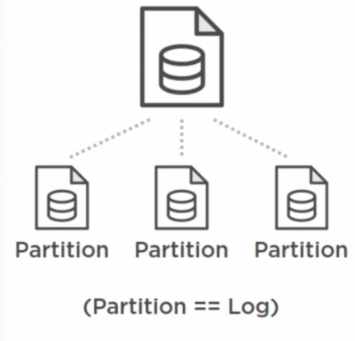

* A logical topic is represented by one or more physical log files called partitions.
* Number of partitions per topic is configurable.
* Partition is how Kafka achieves:
  * Scale
  * Fault tolerance
  * Higher levels of throughput
* Each partition is maintained on at least one or more brokers

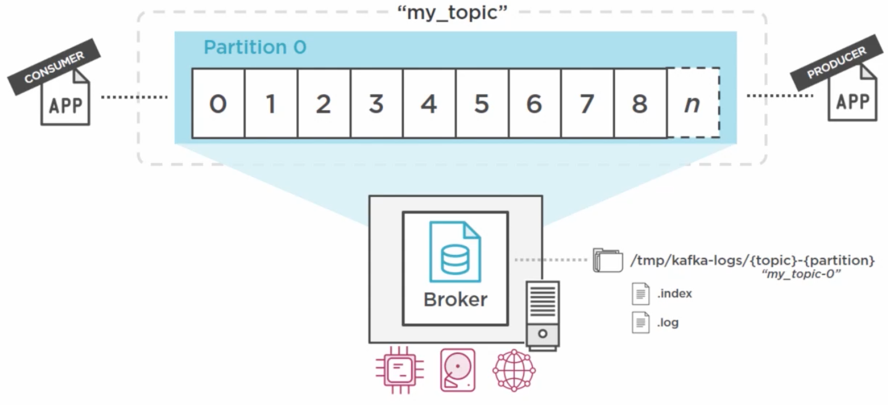

Recall in earlier demo, created `my_topic` with only a single partition and replication factor:

```bash
./opt/kafka/bin/kafka-topics.sh --create --topic my_topic \
  --replication-factor 1 \
  --partitions 1 \
  --zookeeper zookeeper:2181
```

* Each topic must have at least one partition, because that partition is the physical representation of the commit log, stored on one or more brokers.
* Each partition must fit entirely on one machine.
* If choose `--partitions 1` for a topic, this means the entire contents of the topic will only be stored on a single broker, if that node goes down, consumers/producers will be stuck unable to retrieve/publish messages. Also the topic size will be limited by the physical resources on that single broker.

**General rule:** Scalability of Kafka determined by number of partitions being managed by multiple broker nodes.

**Topic with Multiple Partitions**

```bash
./opt/kafka/bin/kafka-topics.sh --create --topic my_topic \
  --replication-factor 1 \
  --partitions 3 \
  --zookeeper zookeeper:2181
```

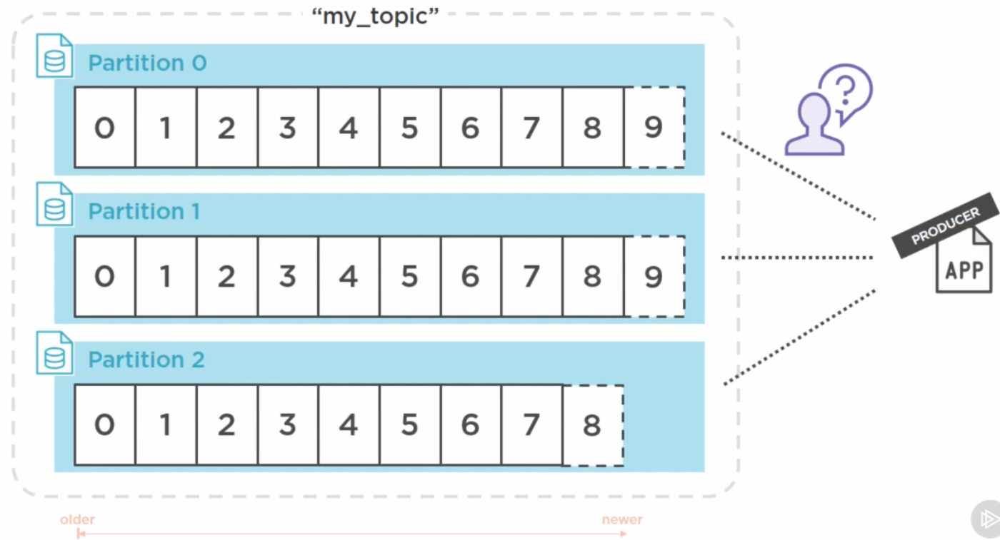

* In this case, the single topic `my_topic` will be split across three different log files.
* Ideally, each partition will be managed by a different broker node, so in this case, we would want at least 3 broker nodes in the cluster.
* Each partition is mutually exclusive from the other, each will receive unique messages from a producer producing messages to this topic.
* Multiple partitions increase parallelism of operations such as message consumption.
* Each partition is still a time-ordered sequence of events that are appended to by producer.

**Allocating Messages Across Partitions**

How does producer split messages across the different partitions that make up the topic its producing to? Based on *partitioning scheme* that is established by producer (will cover more later). In absence of specifying a partitioning scheme, messages will be allocated to partitions based on round-robin. This is important in considering how balanced the partitions are for a given topic.

### Distributed Partition Management

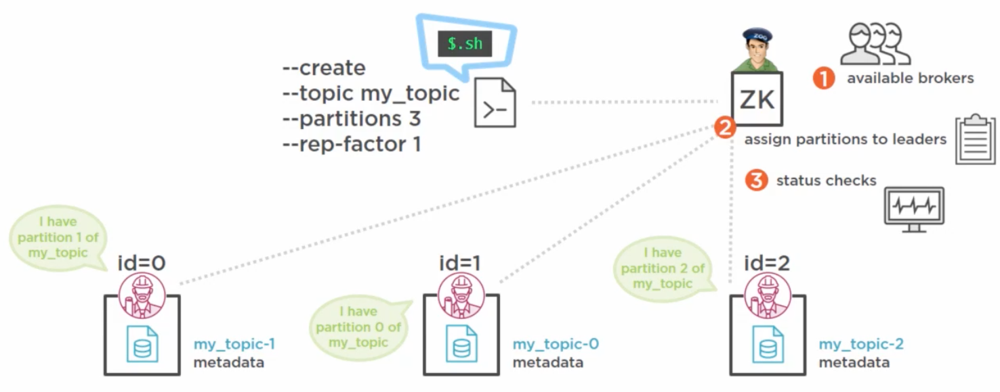

- Command to create topic with `n` partitions handled by Zookeeper, which maintains metadata about the cluster.
- Zookeeper will consider the available brokers, and decide which brokers will be assigned to be the *leaders* responsible for managing a single partition within the topic.
- When a broker receives an assignment from Zookeeper to be the leader of a partition, it creates a log file for this partition. Directory where log file is located will be named based on topic name and partition number.
- Each broker also maintains a subset of the metadata that Zookeeper does, including which partitions are being managed by which brokers in the cluster.
- This means any broker can direct a producer client to the appropriate broker for writing messages to a specific partition.
- Brokers broadcast their status info to Zookeeper so that consensus is maintained across the cluster.

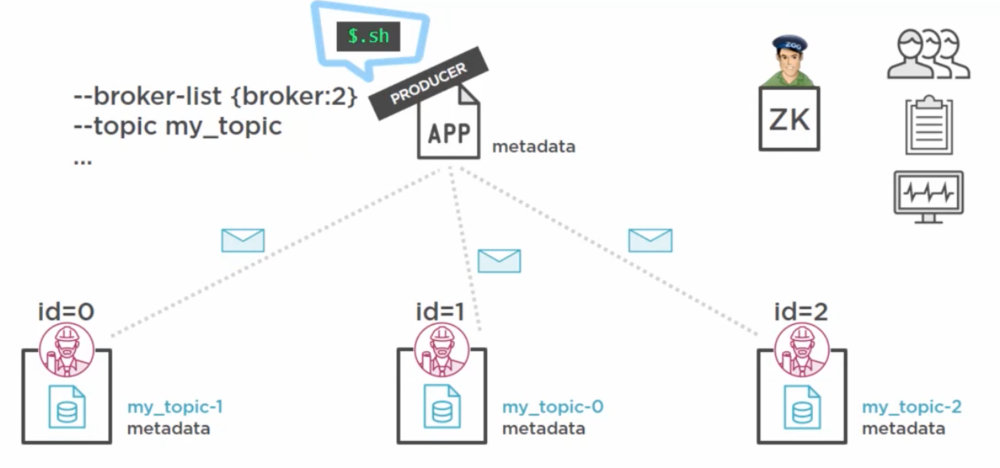

- When producer is preparing to produce a message to a topic, it must know the location of at least one broker in the cluster, so it can find the leaders of the topics' partitions.
- Each broker knows which partitions are owned by which leader.
- Metadata related to topic is sent back to producer, producer uses this info to send messages to the brokers that are participating in managing the partitions that make up the topic.

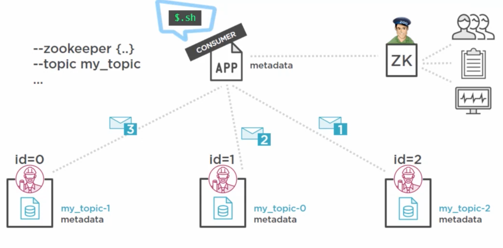

- Consumers operate similarly to producers, except they rely on Zookeeper more
- Consumer queries Zookeeper to determine which brokers own which partitions of a topic.
- Zookeeper also returns metadata to consumer that affects its consumption behaviour, especially critical when there are large groups of consumers sharing the consumption workload of a given topic.
- After consumer receives info about which brokers have the topic partitions, it will pull messages from the brokers, based on message offset per partition.
- Consumers may have to handle message order when consuming messages from multiple partitions, because the messages got produced to these multiple partitions at different times, so consumer may receive messages in different orders in which they were published.

**Partitioning Trade-offs**

* The greater the number of partitions, the greater the Zookeeper overhead (Zookeeper maintains in-memory registry of brokers and partitions). Mitigate by ensuring ZK ensemble is provisioned with appropriate capacity to handle large numbers of partitions.
* Message ordering can become complex. There is no global ordering of messages in a topic across partitions.
* If consuming application absolutely needs global message ordering, use a single partition (but this limits scalability).
* Alternative to above is to put order handling logic in consumer and consumer groups (covered later).
* The greater the number of partitions, the longer the leader fail-over time. It's typically in ~ms, but can add up in a large system (mitigate with multiple clusters).

### Achieving Reliability

aka Fault tolerance. Problems that could arise include:

- Broker failure
- Network issue so that broker is unreachable
- Disk failure


- When ZK determines that a broker is down, it assigns another broker to take its place and updates its metadata accordingly.
- Once metadata is updated, consumers and producers can continue consuming/producing messages to the topic.
- But need redundancy between nodes to avoid data loss (recall physical log file is persisted on the broker that went down), otherwise those previous messages that were persisted on this broker would be lost.

**Replication Factor**

Recall from earlier demo, the `replication-factor` was set to 1, fine for demo but bad for production:

```bash
./opt/kafka/bin/kafka-topics.sh --create --topic my_topic \
  --replication-factor 1 \
  --partitions 1 \
  --zookeeper zookeeper:2181
```

Setting `replication-factor` to 1 means the topics' partitions only have a single replica. Increase this number to achieve:

- redundancy of messages
- cluster resiliency
- fault-tolerance

Setting `replication-factor` to some value `n` that is > 1 guarantees:

- N-1 broker failure tolerance
- 2 or 3 minimum is recommended so that a node failure or required maintenance does not impact cluster

`replication-factor` is configured on a per-topic basis

Example command to create a topic with 3 partitions and 3 replicas:

```bash
./opt/kafka/bin/kafka-topics.sh --create --topic my_topic \
  --replication-factor 3 \
  --partitions 3 \
  --zookeeper zookeeper:2181
```

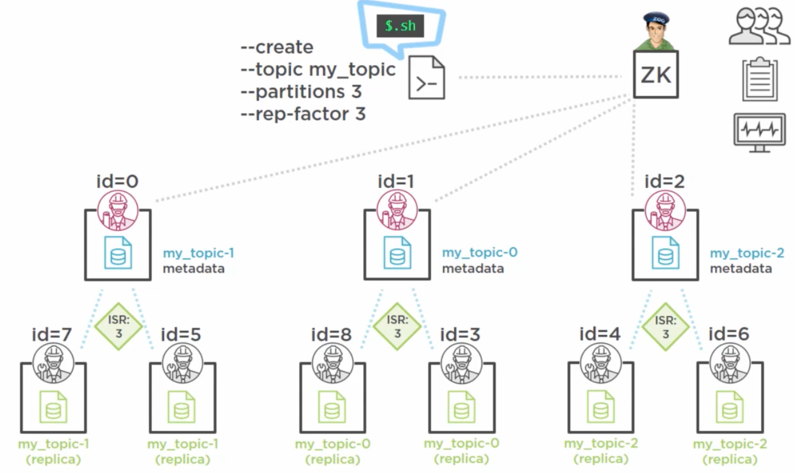

- When replication factor is set to 3, each leader node is responsible to get peer brokers to participate in a *quorum*.
- The quorum is responsible for replicating the log to achieve requested redundancy.
- When broker that is the partition leader has a quorum, it requests its peers to start copying the partition log file.
- When all members of the replication quorum have completed their copy to achieve a full synchronized replica set, it's reported throughout the cluster that the number of *in-sync replicas* (ISR) is equal to requested replication factor for that topic and each partition within that topic.
- When ISR == replication factor, topic and each partition that makes up the topic is in a *healthy* state.
- If quorum can't be established, or ISR falls below replication factor, manual intervention may be required. Kafka will not automatically seek out a new peer to join the quorum. Cluster monitoring is required to detect this.

**Viewing Topic State**

Command to view what's happening with a topic:

```bash
./opt/kafka/bin/kafka-topics.sh --describe --topic my_topic --zookeeper zookeeper:2181
```

Output:

```
Topic: my_topic	TopicId: 4YUMeYFfR-yLgcsXX-zUUQ	PartitionCount: 1	ReplicationFactor: 1	Configs:
Topic: my_topic	Partition: 0	Leader: 1001	Replicas: 1001	Isr: 1001
```

### Demo Fault-tolerance and Resiliency

For this demo, we need 3 brokers. It will be based on this [tutorial](https://codersee.com/how-to-deploy-multiple-kafka-brokers-with-docker-compose/):

```
docker-compose -f docker-compose-multiple.yml up
```

Verify there's a zookeeper container and 3 kafka broker containers:

```
docker-compose -f docker-compose-multiple.yml ps
```

Use ZK shell to verify identity of active brokers:

```
docker exec -it zookeeper /bin/zookeeper-shell localhost:2181
> ls /brokers/ids
# Output: [1, 2, 3]
```

Connect to second broker, create a topic with a single partition and replication factor of 3:

```bash
docker exec -it kafka2 /bin/bash

# create topic
kafka-topics --bootstrap-server localhost:9092 --create --topic replicated_topic --partitions 1 --replication-factor 3

# view topic details - since number of ISRs == number of replicas -> partition and quorum managing it are in a healthy state
# NOTE - leader is node 3
kafka-topics --bootstrap-server localhost:9092 --describe --topic replicated_topic
# Topic: replicated_topic	TopicId: OSUHELIjSqWI3MxXwjk-8A	PartitionCount: 1	ReplicationFactor: 3	Configs:
# Topic: replicated_topic	Partition: 0	Leader: 3	Replicas: 3,2,1	Isr: 3,2,1
```

Create producer and produce some messages to topic: (instructor also specified `--broker-list localhost:9092`):

```
kafka-console-producer --bootstrap-server localhost:9092 --topic replicated_topic
> My Message 1
> My Message 2
> My Message 3
```

Consume messages:

```
kafka-console-consumer --bootstrap-server localhost:9092 --topic replicated_topic --from-beginning
# Outputs the messages, one on each line
```

**Simulate a node failure**

Since node 3 is the leader for the topic partition, let's take it down to see how Kafka handles it:

```
docker-compose -f docker-compose-multiple.yml stop kafka3
docker-compose -f docker-compose-multiple.yml ps
```

Status of containers after stopping kafka3:

```
  Name               Command             State                  Ports
-----------------------------------------------------------------------------------
kafka1      /etc/confluent/docker/run   Up         0.0.0.0:8097->8097/tcp, 9092/tcp
kafka2      /etc/confluent/docker/run   Up         0.0.0.0:8098->8098/tcp, 9092/tcp
kafka3      /etc/confluent/docker/run   Exit 143
zookeeper   /etc/confluent/docker/run   Up         2181/tcp, 2888/tcp, 3888/tcp
```

Connect to kafka1 and view topic details now:

```bash
docker exec -it kafka1 /bin/bash
kafka-topics --bootstrap-server localhost:9092 --describe --topic replicated_topic
# Topic: replicated_topic	TopicId: OSUHELIjSqWI3MxXwjk-8A	PartitionCount: 1	ReplicationFactor: 3	Configs:
# Topic: replicated_topic	Partition: 0	Leader: 2	Replicas: 3,2,1	Isr: 2,1
```

Notice there's a new leader 2, and ISR's are now less than replicas -> quorum is unhealthy due to missing replica. Recall we killed broker 3 so it's no longer in sync.

Note that if there had been another broker available, Kafka would add it to quorum and start replicating to it, to replace the broker that got killed. But in this demo, we only have 3 brokers so there isn't another available.

If had left consumer terminal open, it will show warnings that it couldn't fetch from broker 3, but it doesn't cause consumer to crash.

Producer terminal continues as if nothing happened, can still publish messages and consumer can still consume them.

Bring the downed node back up:

```
docker-compose -f docker-compose-multiple.yml restart kafka3
```

Connect to any node and check topic details again - leader is still 2, but this time, ISR's have increased to 3. i.e. node 3 was brought back into the quorum and had the log replicated.

```bash
docker exec -it kafka2 /bin/bash
kafka-topics --bootstrap-server localhost:9092 --describe --topic replicated_topic
# Topic: replicated_topic	TopicId: OSUHELIjSqWI3MxXwjk-8A	PartitionCount: 1	ReplicationFactor: 3	Configs:
# Topic: replicated_topic	Partition: 0	Leader: 2	Replicas: 3,2,1	Isr: 2,1,3
```

## Producing Messages with Producers

For this part, will use Ruby + Karafka instead of Java.

[Reference Non Rails Example](https://github.com/karafka/example-apps/tree/master/v2.0-non-rails)

Initial setup:

```
docker-compose up
cd project
bundle install
```

Start Karafka console to demo simple produce:

```
bundle exec karafka console
```

```ruby
Karafka.producer.produce_sync(topic: 'example', payload: { 'ping' => 'pong' }.to_json)
```

Optionally start Karafka server (which will make consumers start polling for messages):

```
bundle exec karafka server
```

Send few more messages using WaterDrop:

```
bundle exec rake waterdrop:send
```

### Intro

**Producer Internals**

Producer is a piece of software

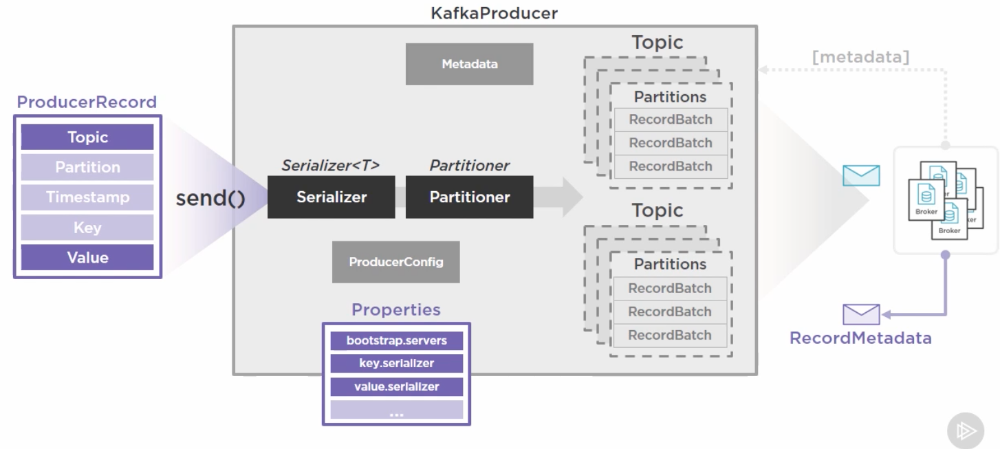

**Configuration**

[Kafka Producer Configs Doc](https://kafka.apache.org/documentation.html#producerconfigs)

[Karafka Configuration Doc](https://karafka.io/docs/Configuration/)

[Karafka API Doc](https://karafka.io/docs/code/karafka)

[WaterDrop API Doc](https://karafka.io/docs/code/waterdrop/)

Kafka configs are specified in `karafka.rb`, eg:

```ruby
class KarafkaApp < Karafka::App
  setup do |config|
    config.client_id = 'my_application'
    # librdkafka configuration options need to be set as symbol values
    config.kafka = {
      'bootstrap.servers': '127.0.0.1:9092'
    }
  end
end
```

Producer doesn't connect to to every broker in `bootstrap.servers` config property, just the first available one. Then it uses this broker to discover the full membership of the cluster including partition leaders.

Best practice is to specify multiple brokers in the `bootstrap.servers` list in case the first broker happens to be unavailable.

Course mentions about setting producer level config `key.serializer` and `value.serializer` but this option doesn't seem to be available in Karafka? Karafka uses [waterdrop](https://github.com/karafka/waterdrop) to produce messages. Here's list of all [config options](https://github.com/confluentinc/librdkafka/blob/master/CONFIGURATION.md). Found a note `serializer is no longer needed because Responders have been removed from Karafka` in [Upgrade doc](https://github.com/karafka/karafka/wiki/Upgrades-2.0).

Message content is encoded in binary to optimize message size.

Producer is responsible to specify how the message contents are to be encoded, so later the consumer will know how to decode them.

Karafka assumes by default that messages sent/received are JSON. [Deserialization](https://github.com/karafka/karafka/wiki/Deserialization)

To produce a message with Karafka (it picks up config from `karafka.app`):

```ruby
10.times do
  message = { 'number' => rand }.to_json
  Karafka.producer.produce_async(topic: 'counters', payload: message)
end
```

`Karafka.producer` is `WaterDrop::Producer`

The `produce_async` method only requires the `topic` and `payload`.

`message` must match serializer (Kafka defaults to JSON).

Optionally can specify `partition` when producing message:

```ruby
Karafka.producer.produce_sync(topic: 'example', payload: { 'ping' => 'pong' }.to_json, partition: 1)
```

Optionally can also specify `timestamp` when producing message:

```ruby
Karafka.producer.produce_sync(topic: 'example', payload: { 'ping' => 'pong' }.to_json, partition: 0, timestamp: 124535353325)
```

Aspects of timestamp are defined in `server.properties`:

```
log.message.timestamp.type = [CreateTime, LogAppendTime]
```

CreateTime: Default, timestamp applied to message is set by producer, this is what gets committed to log.

LogAppendTime: Will use time at which broker appended message to commit log.

Optionally can specify `key` when producing message:

```ruby
Karafka.producer.produce_sync(topic: "example", payload: { 'greeting' => 'hello' }.to_json, key: "foo")
```

key: Determines how and to which partition within a topic, the producer sends a message to. Recall a producer writes to multiple partitions within a topic.

**Best Practice: Define a Key**

It's optional, but you should use it. Purpose of key:

1. Provides additional information in the message.
2. Can determine what partitions messages are routed to.

Drawback: Additional overhead of increased payload size.

### Process of Sending Messages (Part 1)

Modify `ExampleConsumer` to output the message key:

```ruby
class ExampleConsumer < ApplicationConsumer
  def consume
    messages.each do |message|
      key = message.key
      payload = message.payload
      timestamp = message.timestamp
      partition = message.partition
      puts "Key: #{key}, Payload: #{payload}, Timestamp: #{timestamp}, Partition: #{partition}"
    end
  end
end
```

Launch `bundle exec karafka console` and produce a message with a key:

```ruby
Karafka.producer.produce_sync(topic: "example", payload: { 'greeting' => 'hello' }.to_json, key: "foo")
```

Launch `bundle exec karafka server` to have consumer poll for messages, output will be:

```
I, [2023-05-13T07:36:38.466743 #11763]  INFO -- : [c7ba6b9351e0] Consume job for ExampleConsumer on example/0 started
Key: foo, Payload: {"greeting"=>"hello"}, Timestamp: 2023-05-13 07:36:37 -0400, Partition: 0
```

**What's Going On Under the Hood When Producer Sends**

* Producer queries cluster (using bootstrap servers list) to discover cluster membership
* Response comes in the form of metadata containing info about topics, partitions, managing brokers
* Producer uses response to instantiate a Metadata object.
* Producer keeps the Metadata object up-to-date with latest info about cluster.

Producer runs a "pipeline":
* Producer passes message through Serializer
* Then message goes to Partitioner which is responsible for determining which partition to send the record to
* Partitioner can use different partitioning strategies based on info in message

**Producer Partitioning (aka Routing) Strategy**

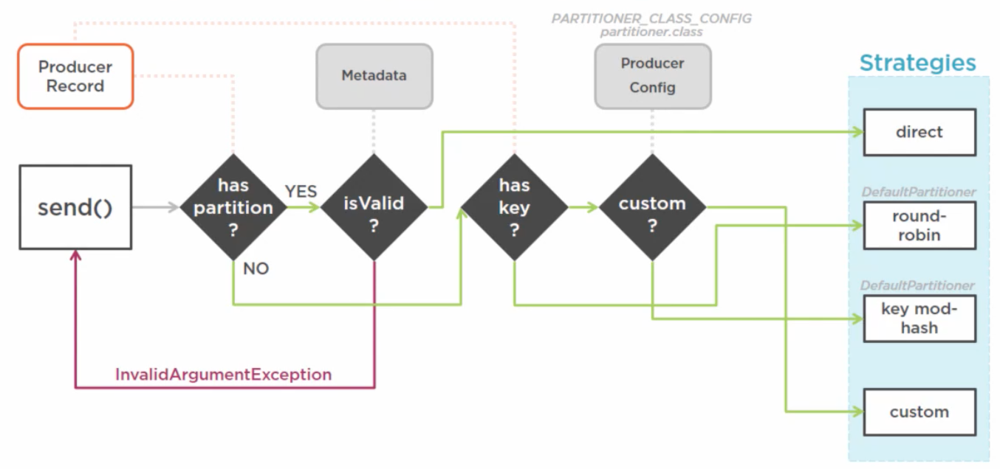

* First the producer looks at the message it has to send and checks if the `partition` field has been specified?
* If partition is specified, then producer needs to make sure its valid, i.e. for the requested topic, does this partition exist?
* To answer if specified partition is valid, producer looks at its Metadata object.
* If Metadata says that partition doesn't exist or is unavailable for the topic, raises "Unknown partition" error.
* If partition is valid, producer will add the record to the specified partition buffer on the topic - this is the `direct` strategy, then on a separate thread, it awaits the result of the `send` operation to broker leader of that partition.
* If partition was not specified, then producer checks if message has a key?
* If no key is specified, then producer uses `round-robin` strategy - evenly distribute messages across all partitions in topic.
* If key is specified, then producer checks whether a custom/non-default partitioning class was configured as part of the producer instantiation.
* If no custom partitioning class is specified but key is specified, producer will use `key mod-hash` strategy. This is default provided by Kafka - it takes a `murmur` of the key, then runs `mod` using num partitions for topic, then routes message to that partition.
* Finally if a custom partitioning class is specified, this means developer is providing their own partitioner implementation, this is the `custom` strategy.

Strategies are:
1. direct
2. round-robin (default partitioner)
3. key mod-hash
4. custom

**Related Concepts in Karafka**

* [partition_key vs key in Waterdrop](https://karafka.io/docs/FAQ/#what-is-the-difference-between-partition_key-and-key-in-the-waterdrop-gem)
* [partition_class setting in Karafka](https://github.com/karafka/karafka/blob/master/lib/karafka/setup/config.rb#L137) - note this is in internal->processing, should not be modified directly.
* [rdkafka-ruby PR to use specified partitioner for partition key](https://github.com/appsignal/rdkafka-ruby/pull/173/files)
* [rdkafka-ruby PR to allow string partitioner config](https://github.com/appsignal/rdkafka-ruby/pull/213/files)
* [karafka pro virtual partitions](https://karafka.io/docs/Pro-Virtual-Partitions/)

### Process of Sending Messages (Part 2)

After partitioning scheme is established, producer dispatches record into an in-memory queue known as `RecordAccumulator`

**Micro-batching in Apache Kafka**

At scale, efficiency is everything.

Each time message is sent, persisted, read - incurs overhead. Can affect performance in high throughput systems.

Analogy: If have a large number of boxes in a garage that need to be moved, its more efficient to use a moving truck rather than a small passenger car. Because with the truck, can transport more boxes at once. Assuming you have the same number of loaders and unloaders, it would take more trips with the smaller vehicle.

Micro-batching refers to small, fast batches of messages, used by: Producer to send, Broker to write, and Consumer to read.

`RecordAccumulator` gives producer ability to micro-batch records intended to be sent at high volumes and high frequency.

Given a record that's been assigned to a partition by the Partitioner, it gets passed to RecordAccumulator. This record gets added to a collection of `RecordBatch` objects, for each TopicPartition.

Each RecordBatch object is a small batch of records, that will be sent to broker that owns the assigned partition.

How many records go in a RecordBatch? Answer comes from advanced config settings, defined at producer level.

### Message Buffering and Micro-batching

Each `RecordBatch` object has a max size as to how many producer records can be buffered. Controlled by `batch.size` setting.

There's also `buffer.memory` setting to set max memory (in bytes) that can be used to buffer all records waiting to be sent.

If number of records waiting to be sent reaches `buffer.memory`, then `max.block.ms` setting is used. Determines how many milliseconds the `send` method is blocked for. During `max.block.ms`, records get sent, freeing up buffer memory for more records to get queued.

When records get sent to a RecordBatch, will wait there until:
1. `batch.size` of that RecordBatch is reached, then sent immediately.
2. `linger.ms` is reached - number of milliseconds a non-full buffer should wait before transmitting the records.

After messages are sent, broker responds with `RecordMetadata` which indicates whether send was successful or not.

### Message Delivery and Ordering Guarantee

**Delivery Guarantees**

When sending messages, producer can specify the level of acknowledgement `acks` it wants from broker. Options for `acks` setting are:
* 0: fire and forget - risky, no ack will be sent by broker, fast, but not reliable. Eg: broker could be having issue that prevents it from persisting message in commit log, but producer app will never get to know about this and will keep sending messages that get lost. Could be fine for applications in which some data can be "lossy", such as clickstream data.
* 1: leader acknowledged - producer only asking for leader broker to confirm receipt, but does not wait for all replica members to also confirm receipt. Good balance between performance and reliability.
* 2: replication quorum acknowledged - producer requesting that all in-sync replicas confirm receipt, before broker will consider that message has been sent successfully. Highest reliability, but worst performance.

If broker responds with error, producer needs to decide how to handle it:
* `retries` config setting controls how many times producer will retry to send message before aborting.
* `retry.backoff.ms` config setting specifies wait period in milliseconds between retries

**Ordering Guarantees**

Message order is only preserved within a given partition. If producer sends messages to a partition in a particular order, that will be the order in which the broker appends those messages to the log. And consumers will read these messages from the log in the same order.

There is no global order across partitions. If this is required, have to handle at consumer.

Error handling can complicate ordering, recall settings `retries` and `retry.backoff.ms`. Eg: If `retries` is enabled and `retry.backoff.ms` value is set too low: 1st message sent, but producer doesn't receive ack within `retry.backoff.ms` milliseconds, so producer will retry. But before the retry can be sent, 2nd message is sent and receives ack in time. And then the first message retry works. Results in reverse order, even within the same partition, where second message will be written first in partition, followed by first message.

To avoid above situation, can set `max.in.flight.request.per.connection` setting to 1. This tells producer only 1 request can be made at any given time. But this would drastically lower throughput.

**Delivery semantics**

Options are:

* At-most-once
* At-least-once
* Only-once

### Demo

Run with 3 brokers, create a topic with 3 partitions and replication factor of 3. Run a producer sending multiple messages each with a key, payload is an increasing sequence of integers. Log payload from consumer, observe that messages do not arrive in order.

```
docker-compose -f docker-compose-multiple.yml up
```

Shell into one of the brokers to create a topic with 3 partitions:

```bash
docker exec -it kafka1 /bin/bash

# create topic
kafka-topics --bootstrap-server localhost:9092 --create --topic ordering_demo --partitions 3 --replication-factor 3

# confirm topic config
kafka-topics --bootstrap-server localhost:9092 --describe --topic ordering_demo
# Topic: ordering_demo	Partition: 0	Leader: 2	Replicas: 2,3,1	Isr: 2,3,1
# Topic: ordering_demo	Partition: 1	Leader: 3	Replicas: 3,1,2	Isr: 3,1,2
# Topic: ordering_demo	Partition: 2	Leader: 1	Replicas: 1,2,3	Isr: 1,2,3
```

Register a consumer in `karafka.rb`:

```ruby
class App < Karafka::App
  setup do |config|
    config.concurrency = 5
    config.max_wait_time = 1_000
    config.kafka = { 'bootstrap.servers': ENV['KAFKA_HOST'] || '127.0.0.1:8097' }
  end
end

App.consumer_groups.draw do
  topic :ordering_demo do
    consumer OrderingDemoConsumer
  end
end
```

Add the consumer class:

```ruby
class OrderingDemoConsumer < ApplicationConsumer
  def consume
    messages.each do |message|
      key = message.key
      payload = message.payload
      timestamp = message.timestamp
      partition = message.partition
      offset = message.offset
      puts "Key: #{key}, Payload: #{payload}, Timestamp: #{timestamp}, Partition: #{partition}, Offset: #{offset}"
    end
  end
end
```

Launch Karafka console:

```
bundle exec karafka console
```

Generate 100 messages in sequence (aka producer) with randomly generated hex key:

```ruby
100.times do |i|
  message = { 'number' => i }.to_json
  key = SecureRandom.hex(4)
  puts "Sending message #{i}, key #{key}"
  Karafka.producer.produce_async(topic: 'ordering_demo', key: key, payload: message)
end
```

Launch Karafka server to get the consumer to start polling:

```
bundle exec karafka server
```

Observe the output from consumer, messages are read from various partitions, not in global sequence 0->99. First few lines shown here:

```
Key: 3c096b7a, Payload: {"number"=>0}, Timestamp: 2023-05-14 08:53:12 -0400, Partition: 1, Offset: 0
Key: 6857951e, Payload: {"number"=>14}, Timestamp: 2023-05-14 08:53:12 -0400, Partition: 1, Offset: 1
Key: e0dd1e50, Payload: {"number"=>1}, Timestamp: 2023-05-14 08:53:12 -0400, Partition: 2, Offset: 0
Key: 6c3b9615, Payload: {"number"=>5}, Timestamp: 2023-05-14 08:53:12 -0400, Partition: 2, Offset: 1
Key: ccd171ec, Payload: {"number"=>19}, Timestamp: 2023-05-14 08:53:12 -0400, Partition: 1, Offset: 2
Key: 573160dc, Payload: {"number"=>20}, Timestamp: 2023-05-14 08:53:12 -0400, Partition: 1, Offset: 3
Key: 2ef69d3a, Payload: {"number"=>27}, Timestamp: 2023-05-14 08:53:12 -0400, Partition: 1, Offset: 4
Key: bb054389, Payload: {"number"=>28}, Timestamp: 2023-05-14 08:53:12 -0400, Partition: 1, Offset: 5
Key: 57885415, Payload: {"number"=>29}, Timestamp: 2023-05-14 08:53:12 -0400, Partition: 1, Offset: 6
Key: fcd22d6a, Payload: {"number"=>6}, Timestamp: 2023-05-14 08:53:12 -0400, Partition: 2, Offset: 2
Key: 583fa48f, Payload: {"number"=>8}, Timestamp: 2023-05-14 08:53:12 -0400, Partition: 2, Offset: 3
Key: 2694794b, Payload: {"number"=>9}, Timestamp: 2023-05-14 08:53:12 -0400, Partition: 2, Offset: 4
Key: 2c6f99ec, Payload: {"number"=>10}, Timestamp: 2023-05-14 08:53:12 -0400, Partition: 2, Offset: 5
Key: 52f9467e, Payload: {"number"=>12}, Timestamp: 2023-05-14 08:53:12 -0400, Partition: 2, Offset: 6
Key: 82ccd3e8, Payload: {"number"=>18}, Timestamp: 2023-05-14 08:53:12 -0400, Partition: 2, Offset: 7
Key: abd2cb66, Payload: {"number"=>2}, Timestamp: 2023-05-14 08:53:12 -0400, Partition: 0, Offset: 0
Key: 9ee9a673, Payload: {"number"=>3}, Timestamp: 2023-05-14 08:53:12 -0400, Partition: 0, Offset: 1
Key: 57d49c6f, Payload: {"number"=>4}, Timestamp: 2023-05-14 08:53:12 -0400, Partition: 0, Offset: 2
Key: 3393e58b, Payload: {"number"=>7}, Timestamp: 2023-05-14 08:53:12 -0400, Partition: 0, Offset: 3
...
```

Note: If stop containers, then try to re-up them, may get errors like:

```
ERROR Error while creating ephemeral at /brokers/ids/1, node already exists
and owner '72075955082625025' does not match current session '72075962265632769'
```

Workaround:

```
docker-compose -f docker-compose-multiple.yml stop
docker-compose -f docker-compose-multiple.yml rm -f
docker-compose -f docker-compose-multiple.yml up
```

Data directories are mapped to named volumes in `docker-compose-multiple.yml` so previously created topics, partitions, messages, etc. should be preserved even after containers are removed.

### Advanced Topics

Not in scope of course:

* Custom serializers, see this [demo project](https://github.com/danielabar/karafka_avro_demo/blob/main/karafka.rb#L33-L56) for example of using Avro deserializer.
* Custom Partitioners
* Asynchronous Send, in Karafka, this is `Karafka.producer.produce_async(topic: 'person', payload: message)`
* Compression
* Advanced Settings

## Consuming Messages with Consumers

Diagram below, details will be explained going through this section:

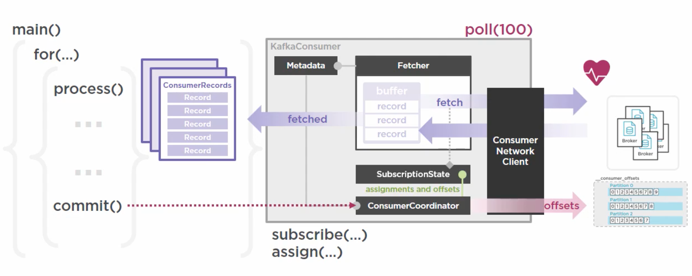

Some overlapping config with producers:

* `bootstrap.servers`: Cluster membership - partition leaders, etc.
* `key.deserializer`, `value.deserializer`: Classes used for message deserialization. These must match how the producer serialized the messages.

[Consumer Config Docs](https://kafka.apache.org/documentation.html#consumerconfigs)

### Subscribing and Unsubscribing to Topics

In Karafka, use the [routing DSL](https://karafka.io/docs/Routing/):

```ruby
# karafka.rb
App.consumer_groups.draw do
  topic :example do
    consumer ExampleConsumer
  end
end
```

With Kafka, a consumer can subscribe to any number of topics.

### Subscribe vs Assign

When consumer *subscribes* to topic, this leads to automatic (or dynamic) partition assignment. i.e. the single consumer instance will poll from every partition within that topic.

When consumer subscribes to multiple topics, it will poll from every partition within every topic.

A consumer could instead use the `assign` method, which will subscribe it to a particular partition. Consumer will poll one or more partitions, regardless of the topic they're a part of. This is an advanced use case.

### Single Consumer Topic Subscriptions

Consumer that is subscribed to a topic constantly polls all partitions of the topic, looking for new messages to consume. If it's subscribed to multiple topics, will poll all partitions of all topics, which can be a lot of work for a single consumer instance to be doing.

Benefit of `subscribe` method is that partition management is handled automatically, don't need additional custom logic in consumer to do this.

Eg: Suppose new partition is added to topic (cluster administrator could be trying to improve scalability). This changes cluster metadata, which gets sent to consumer. Consumer will automatically use the updated metadata to add new partition to its topic list and start polling for messages.

**assign**

In this case, consumer assigns itself a list of specific partitions (these could belong to different topics, but consumer isn't really operating at the topic level here, although it is aware of what partition belongs to what topic). If a new partition is added, consumer will be notified, but won't change its behaviour.

### The Poll Loop

* Primary function of consumer is to execute the `poll()` loop
* Continuously polls brokers for data
* Single API for handling all consumer/broker interactions (more interactions beyond message retrieval, will cover later)

When using Karafka, it manages the poll loop for you, no need to write this loop in consumers.

Useful tool provided by Kafka for perf testing:
```
docker exec -it kafka1 /bin/bash

kafka-producer-perf-test --topic ordering_demo --num-records 50 --record-size 40 --throughput 10 --print-metrics --producer-props bootstrap.servers=localhost:9092 key.serializer=org.apache.kafka.common.serialization.StringSerializer value.serializer=org.apache.kafka.common.serialization.StringSerializer
```

`record-size` is in bytes.

`throughput` is number of messages per second, or -1 for now throttling.

Note that by default, Karafka uses [JSON::Deserializer](https://github.com/karafka/karafka/blob/master/lib/karafka/serialization/json/deserializer.rb). But the Kafka perf test produces string messages using built-in Kafka string serializer. To be able to consume these, change consumer to use a String deserializer as follows:

```ruby
# karafka.rb
App.consumer_groups.draw do
  topic :ordering_demo do
    consumer OrderingDemoConsumer
    deserializer StringDeserializer.new
  end
end
```

```ruby
# lib/string_deserializer.rb
class StringDeserializer
  def call(params)
    params.raw_payload.to_s
  end
end
```

Leave consumer running via `bundle exec karafka server`. Then

Use `kafka-topics` shell program to `alter` existing topic to increase partitions from 3 to 4:

```bash
docker exec -it kafka1 /bin/bash

# alter topic
kafka-topics --bootstrap-server localhost:9092 --alter --topic ordering_demo --partitions 4

# confirm updated topic config
kafka-topics --bootstrap-server localhost:9092 --describe --topic ordering_demo
Topic: ordering_demo	TopicId: 1U2pjiRYTMC5NYm8cWVgeQ	PartitionCount: 4	ReplicationFactor: 3	Configs:
# Topic: ordering_demo	Partition: 0	Leader: 2	Replicas: 2,3,1	Isr: 2,3,1
# Topic: ordering_demo	Partition: 1	Leader: 3	Replicas: 3,1,2	Isr: 3,1,2
# Topic: ordering_demo	Partition: 2	Leader: 1	Replicas: 1,2,3	Isr: 1,2,3
# Topic: ordering_demo	Partition: 3	Leader: 2	Replicas: 2,3,1	Isr: 2,3,1
```

Run the perf test again, should see consumer automatically detecting new partition and consuming from it.

### Consumer Polling

When either `subscribe` or `assign` method invoked on consumer, content of collections (topics, partitions) are used to populate `SubscriptionState` object. This object interacts with `ConsumerCoordinator`, which manages partition offsets.

When `poll` is invoked, consumer settings (such as bootstrap server) used to request metadata about the cluster. This is stored in internal `Metadata` object in consumer, which is periodically updated as `poll` method runs.

`Fetcher` object handles communication between consumer and cluster. `fetch` operations will do this.

`ConsumerNetworkClient` performs actual communication between consumer and cluster. This sends TCP packets. It sends heartbeats to let the cluster know which consumers are still connected.

Once `Metadata` is available, the `ConsumerCoordinator` can do its work. It maintains awareness of automatic/dynamic partition re-assignment. It also commits offsets to the cluster.

The `Fetcher` gets info from `SubscriptionState` about what topic/partitions it should be requesting messages for.

When poll is invoked, it gets passed a timeout in ms, eg: `poll(100)`. This is number of ms consumer network client should spend polling cluster for messages before returning. This is min amt of time each message retrieval cycle takes.

When timeout expires, a batch of records is returned and added to in-memory buffer. They get parsed, deserialized, and grouped into `ConsumerRecords` by topic and partition.

### Message Processing

* `poll()` process is a single-threaded operation.
* There is one `poll` loop per consumer.
* Can only have a single thread per consumer (but Karafka is multi-threaded!)
* This design is to keep the consumer simple
* Parallelism of message consumption happens in a different way (covered later)

After `poll` method has returned messages (aka consumer records) for processing:

* Consumer must iterate over the returned messages to process them one at a time
* `main()` -> `for()` -> `process()`
* What happens in `process` is business logic determined by consumer application developer
* But careful with too heavy processing because that will block the single thread
* However, due to Kafka architecture, one slow consumer will not impact overall cluster performance

### Consumer Offset in Detail

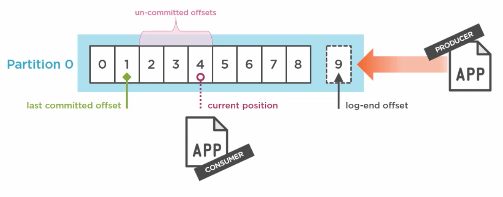

* Offset enables consumers to operate independently.
* Offset is last message position in a topic partition that the consumer has read.
* There are different categories of offsets
* When consumer starts reading from partition, first it needs to determine what it has already read, and what it hasn't yet read. The answer to this is `last committed offset`.
* `last committed offset` is the last record that consumer has *confirmed* to have processed.
* Offsets apply to each partition, i.e. for a given topic, consumer may have multiple different offsets its keeping track of, one for each partition in topic.
* As consumer reads records from `last committed offset`, it keeps track of its `current position`.
* `current position` advances as consumer advances towards end of commit log.
* Last record in partition is `log-end offset`
* `current position` can be ahead of `last committed offset`, this difference is: `un-committed offsets`. A robust system design will keep this gap as narrow as possible.

Optional consumer properties that affect its behaviour wrt offset management:

1. `enable.auto.commit`: Defaults to `true`. This gives Kafka responsibility to manage when `current` offset is upgraded to `committed`. Kafka implements this by using an interval of time (see next property), and runs a commit action each unit of time.
2. `auto.commit.interval`: Defaults to `5000` ms. i.e. Kafka will commit the current offset every 5 seconds.

Need to be careful about how Kafka's auto-commit behaviour (if enabled by above settings) will interact with custom business processing logic.

Eg: `last committed = 3` and `current position = 4`. Suppose the current record being processed (at offset 4) takes longer than 5000 ms to be processed. Kafka will autocommit and update `last committed = 4`, even if consumer is still in the middle of processing the current position of 4. This is not consistent. Could be ok with an "eventually consistent" system. Leads to *reliability* topic.

**Reliability**

> The extent in which your system can be tolerant of eventually consistency is determined by its reliability.

i.e. if system cannot ensure robustness and reliability, then "eventual consistency" can lead to "never consistent".

Suppose in the middle of processing current position 4 which is taking longer than 5000 ms (recall Kafka has auto committed it), some error occurs and processing fails. Now its hard for consumer to know how far back to go and start processing again. Because Kafka has already autocommitted position 4.

Impacts will vary depending on if there's a single consumer or multiple consumers operating within a consumer group (more on this later).

### Offset Behaviour and Management

* It's possible for a message to be read, but not committed,depends on offset management mode.
* Offset commit behaviour is configurable:
  * `enable.auto.commit = true` (default): When true, Kafka manages commits. This is generally convenient, but can cause issues if some records take longer than the `auto.commit.interval` to be processed and an error occurs during processing.
  * `auto.commit.interval.ms = 5000` (default): This is the commit frequency, which can be adjusted to fit consumer application. You can increase this value if you know that some record processing may take longer than this. However, having this larger also creates an offset gap, where commits lag behind processing position. Having a gap means potential inconsistencies, could lead to duplication of record processing on restart.
  * `auto.offset.reset = latest` (default): Strategy to use when consumer starts reading from a new partition. Default is to start reading from the latest known committed offset. Could be set to `earliest`. There's also a `none` setting where Kafka will throw exception to consumer, which must then decide what to do.

Offset behaviour and related issues vary depending on: Single Consumer vs. Consumer Group

**Storing the Offsets**

Kafka stores offsets in a dedicated topic named `__consumer_offsets`. It has 50 partitions, can see this in a broker shell:

```bash
kafka-topics --bootstrap-server localhost:9092 --describe __consumer_offsets
# Topic: __consumer_offsets	TopicId: 2rTbvkVmQz-ArNPd00ZLzQ	PartitionCount: 50	ReplicationFactor: 3	Configs: compression.type=producer,cleanup.policy=compact,segment.bytes=104857600
# Topic: __consumer_offsets	Partition: 0	Leader: 3	Replicas: 3,1,2	Isr: 3,1,2
# Topic: __consumer_offsets	Partition: 1	Leader: 1	Replicas: 1,2,3	Isr: 1,2,3
# Topic: __consumer_offsets	Partition: 2	Leader: 2	Replicas: 2,3,1	Isr: 2,3,1
# Topic: __consumer_offsets	Partition: 3	Leader: 3	Replicas: 3,2,1	Isr: 3,2,1
# ...
```

 In a broker shell, use `kafka-get-offsets` to determine what offsets are persisted for a given topic:

```bash
kafka-get-offsets --bootstrap-server localhost:9092 --topic ordering_demo
# ordering_demo:0:15
# ordering_demo:1:16
# ordering_demo:2:19
```

The `ConsumerCoordinator` component of the consumer is responsible for producing messages with the offset values to the `__consumer_offsets` topic. i.e. a consumer also functions as a producer.

**Offset Management**

There are two modes: Automatic (default) and Manual.

Manual mode is an advanced usage.

To use manual mode: `enable.auto.commit = false`. In this case, the `auto.commit.interval.ms` property is ignored.

In manual mode, consumer takes full responsibility for committing offset after record is considered fully processed. It needs to use the commit api which is either:
* `commitSync()`
* `commitAsync()`

For Karafka, see [Offset management(checkpointing)](https://karafka.io/docs/Offset-management/)

### CommitSync and CommitAsync

Use `commitSync()` when need precise control over when a record is considered completely processed. Good for environments that need high levels of consistency, and don't ever want to retrieve new records for processing, until absolutely sure that the current record(s) have been committed.

Recommendation is to invoke `commitSync()` *after* consumer has completed iterating/processing a batch of records. i.e. don't call it in the middle of the for loop that's processing records but after.

Note that this method will introduce latency because its synchronous, i.e. blocks until receives response from cluster.

`commitSync()` will automatically retry until it succeeds or receives unrecoverable error from cluster. The retry interval is controlled with setting `retry.backoff.ms`, which defaults to `100` ms.

In a Karafka consumer, use `mark_as_consumed!` for a blocking offset commitment, and `mark_as_consumed` for nob-blocking.

`commitAsync()` can also be used to control when messages are considered fully processed. This version of the method is non-blocking, however, its also non-deterministic. i.e. you won't know exactly when commit succeeded or failed. This version does not auto retry, because retrying without knowing whether previous call succeeded/failed can lead to ordering issues or record duplication.

With async version, can use a callback to be notified of response from cluster whether commit succeeded/failed (don't see this as an option in Karafka?).

Async method is non blocking -> better throughput and performance because consumer is not waiting for a response before it continues processing. However, recommend always using it with a callback to handle response from cluster.

### When to Manage Your Own Offsets

**Committing Offsets**

Offset management happens after `poll()` method has timed out and returned records for processing.

Could be either auto commit or consumer explicitly calling one of the commit APIs (commitSync or commitAsync).

`commit()` process takes a batch of records, determine their offsets, and ask ConsumerCoordinator to commit these to the cluster.

ConsumerCoordinator commits the offsets via ConsumerNetworkClient.

After offsets have been confirmed to have been committed by the cluster, ConsumerCoordinator updates the `SubscriptionState` object.

Given that the `SubscriptionState` object is up to date, the fetcher then knows what offsets have been committed and what should be the next records it needs to be retrieved.

**Going It Alone**

Reasons why you might want to take control of offset management yourself rather than letting Kafka handle it via auto.commit:

* Consistency control: May need finer grained control over when a message is considered processed and ready to commit. i.e. you have your own definition of "done", whereas the Kafka auto.commit thinks done is when the `auto.commit.interval` ms has expired.
* Atomicity: Being able to treat steps of message consumption and processing as single atomic operation (analogy to relational database transaction). Needed by systems that need to be highly consistent.
* Exactly once vs At-least-once: If your system must have "Exactly once" message processing, need to manage your own offsets. With a distributed system, it's possible that messages will arrive out-of-order or have duplicate messages.

### Scaling-out Consumers

If stick with only a single consumer, it may become responsible for reading dozens or more topics, each with multiple partitions, which could lead a consumer consuming from hundreds of partitions. Will be too much work for a single process, especially a single-threaded process (recall `poll()` process is a single-threaded application).

Solution is to scale out the number of consumers consuming messages. But they can't be completely independent, they need to work together as a group.

**Consumer Groups**

Recall previous discussions about scaling out various parts of Kafka:

* Need more production capacity? Add more producers.
* Need more message retention and redundancy? Add more brokers.
* Need more metadata management facilities? Add more Zookeeper members.
* Need greater ability to consumer and process messages? Use Consumer Groups.

Consumer Groups: Independent consumers processes working as a team.

A consumer joins a group by specifying the `group.id` setting as config property before it starts.

When consumers are in a group, message processing for a given topic is distributed evenly across number of consumers in the group.

Using consumer groups:
* Increases parallelism and throughput.
* Improves redundancy - if one consumer fails, the work will be automatically re-balanced across the remaining consumers.
* Improves performance - a group of consumers can get through a large backlog of messages faster than a single consumer.

**Example**

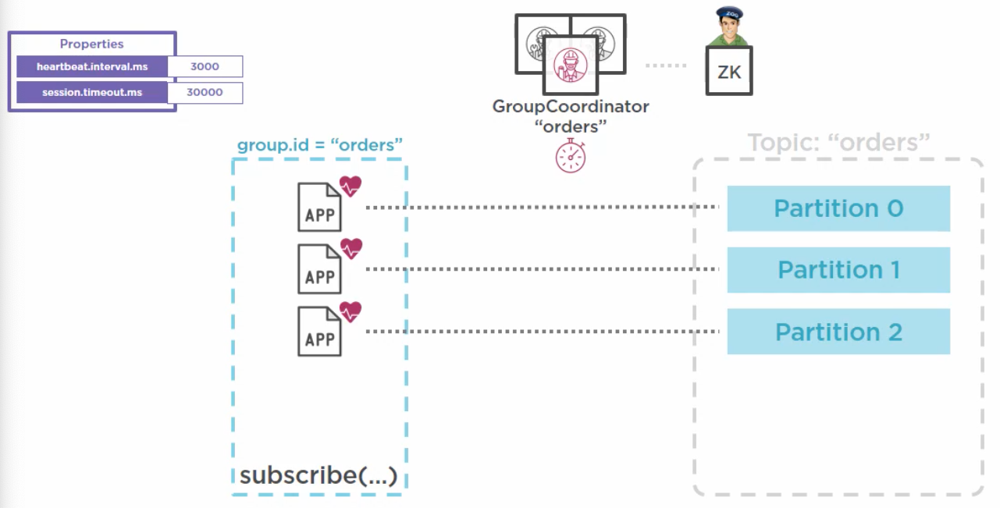

* Three consumers specify `group.id = "orders"` to join the `orders` consumer group.
* Each consumer invokes the `subscribe(...)` method, passing in `orders` topic name.
* Kafka designates/elects one broker from the cluster to serve as the `GroupCoordinator` for the `orders` group.
* The `GroupCoordinator` broker is responsible to monitor/maintain groups' membership.
* `GroupCoordinator` works with cluster coordinator and Zookeeper to assign/monitor partitions within a topic to individual consumers within the group.
* When consumer group is formed, each consumer sends heartbeats (controlled via `heartbeat.interval.ms` default 3000, and `session.timeout.ms` properties, default 30000).
* `GroupCoordinator` uses the consumer heartbeats to determine whether that consumer is still alive and able to participate in the group.
* `session.timeout.ms` is max amount of time `GroupCoordinator` will wait before not receiving any heartbeats from a consumer. If this occurs, group coordinator will consider this consumer to have failed and take corrective action.

**Consumer Rebalance**

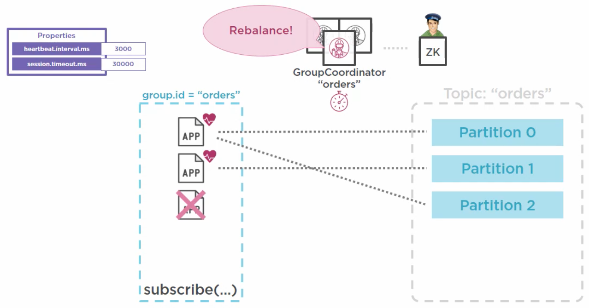

* If a consumer fails, the load will be rebalanced - group coordinator will re-assign the failing consumers' partition to another consumer.
* So now another consumer is taking on twice the load.
* The consumer that got re-assigned the failed consumers partition needs to figure out where the failed consumer left off and catch up, ideally, without re-processing records that were previously processed by the failed consumer.

Left at 4:40
